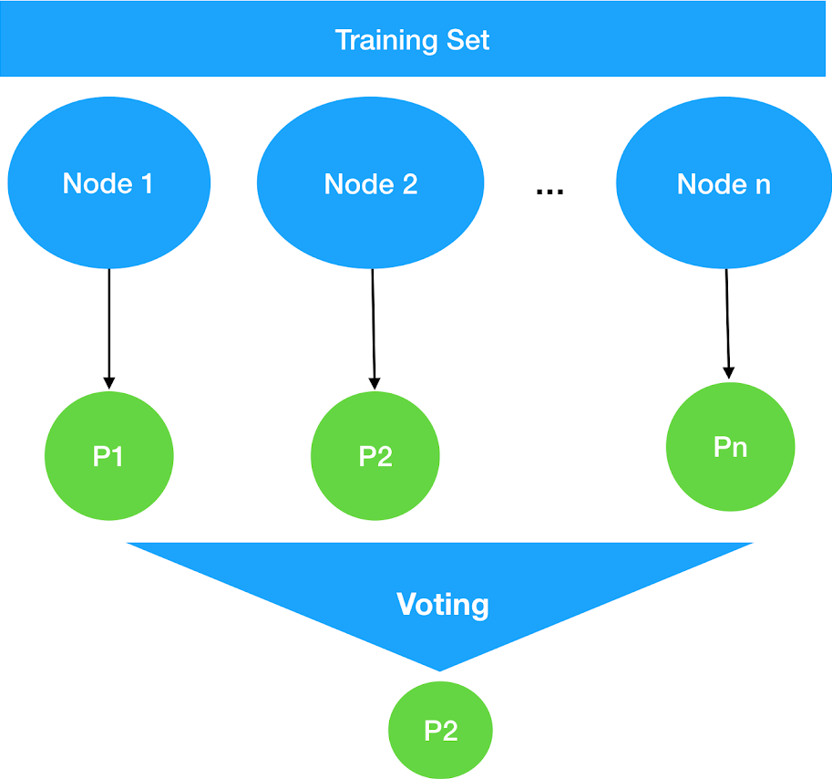

NLP Bagging
=========

Nodes Bagging for NLP Tools



## Installation

  `npm install nlp-bagging`

## Usage
  ```node
    let nlpBagging = new NlpBagging([{
      type: 'Luis',
      config: {
        url: 'https://brazilsouth.api.cognitive.microsoft.com/luis/v2.0/apps/aaa111',
        headers: {
          'subscription-key': '--------',
          verbose: true,
          timezoneOffset: 0
        }
      }
    },{
      type: 'Luis',
      config: {
        url: 'https://brazilsouth.api.cognitive.microsoft.com/luis/v2.0/apps/xxxaaa',
        headers: {
          'subscription-key': '--------',
          verbose: true,
          timezoneOffset: 0
        }
      }
    },{
      type: 'Luis',
      config: {
        url: 'https://brazilsouth.api.cognitive.microsoft.com/luis/v2.0/apps/abc123',
        headers: {
          'subscription-key': '---------',
          verbose: true,
          timezoneOffset: 0
        }
      }
    }]);

    nlpBagging
      .getIntent('hi')
      .then(function(i) {
        console.log(i.topScoringIntent);
      });

    nlpBagging
      .getIntent('are you a bot')
      .then(function(i) {
        console.log(i.topScoringIntent);
      });
  ```

## Tests

  `npm test`

## Contributing

In lieu of a formal style guide, take care to maintain the existing coding style. Add unit tests for any new or changed functionality. Lint and test your code.

### Supporting others NLP tools

1) Create your file in folder `types`, following `luis.js` example.
2) Add your type to `types/type.js` mapper.
